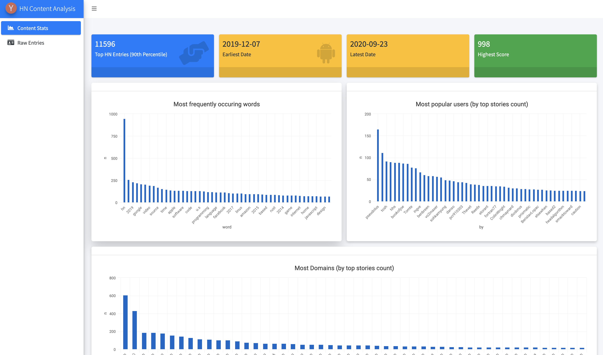

# hn_content_analysis
HN Content Analysis for WhyR 2020 Hackathon

### Data
Download Data from [WhyR2020](https://github.com/WhyR2020/hackathon) and save it under `hackathon/data` or adjust your folder path in the `app.R` code!

### Run 

`shiny::runApp()`

### Required Packages

```r
library(shiny)
library(bs4Dash)
#library(googlesheets4)
library(tidyverse)
library(highcharter)
library(waiter)
library(DT)
library(tidytext)
#library(ggwordcloud)
library(jsonlite)
#library(hackeRnews)
#future::plan(future::multiprocess)
library(urltools)
```


